## Hi there 👋, I am [Ahmed Saed](https://github.com/Ahmedsaed)

I'm a **senior** student at Misr University For Science and Technology (MUST) 🏛. A passionate learner who's always willing to learn and work across technologies and domains 💡. I love to explore new technologies and leverage them to solve real-life problems ✨. I'm currently into **Artificial Intelligence** 🤖 and **Low-Level Software Development** 🔗.

### 👨‍💻 Talking about me:

- 🛠 I’m currently working with C for low-level programming, and Python and Tensorflow for AI
- 🔭 I’m currently working on Semantic MultiModal Search Engine (SMSE)
- 🌱 I’m currently learning Low-Level Software Development
- 💬 Ask me about anything [here](https://github.com/Ahmedsaed/Ahmedsaed/discussions/3)
- 📫 How to reach me: mail@ahmedsaed.me
- ❤️ Fell in love with Fedora Linux
- ⚡ Fun fact: pizza 🍕 is the volume of a cylinder whose radius z and depth a

### ⚡ GitHub Stats:

### ☄️ Github Streaks:

	

 

	
   
  
<b>⚙️ My Workflow And Tools</b>

  	<ul>
  	  <li><b>OS:</b> Fedora Linux </li>
	    <li><b>Laptop: </b> Lenovo Ideapad 320 (i5)</li>
	    <li><b>PC: </b> Intel Core I7, 16GB Ram, AMD RX 470 </li>
  	  <li><b>Browser: </b> Zen </li>
	    <li><b>Terminal: </b> ZSH </li>
	    <li><b>Code Editor:</b> VSCode </li>
	  </ul>	

	
   
  
<b>🤠Like My Work:</b>

  

